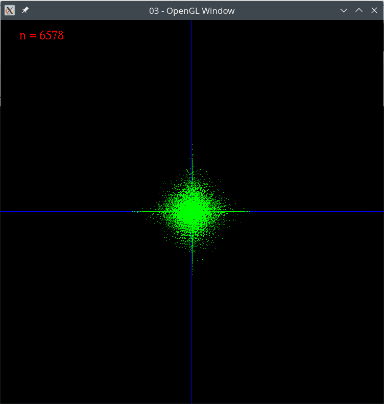

# RandomWalk
Visualization of a random walk on a simple graph implemented in OpenGL. The program was created for a research seminar dedicated to deriving the analog of a mean value theorem on stratified sets.

  
*Fig. 1: A fixed number of points (10^5) are spawned at the origin and evolve with equal probabilities in four directions. Number n is the number of steps taken.*
